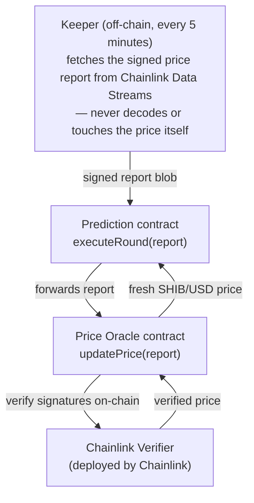

This page explains how the Prediction game works at the smart-contract level. You don't need any of this to play — see the [How To guide](prediction-guide) for that — but if you want to verify the game's fairness for yourself, start here.

## Architecture

The game is built from two on-chain contracts plus an off-chain keeper that drives the round clock:

Key properties of this design:

- **The keeper cannot lie about the price.** It only ferries the full signed report from Chainlink's Data Streams API to the contract. The oracle contract sends that report to Chainlink's on-chain Verifier, which checks the decentralized oracle network's signatures before the price is accepted. A compromised keeper key cannot forge a price.
- **There is no manual price override.** Signed reports are the only way a price enters the system. If the feed is unavailable, the game halts and open bets become refundable — funds are never settled against an unverified price.
- **The price is fresh by construction.** Verification, storage, and round settlement happen in the *same transaction*, and the report is rejected if it is stale, expired, or for the wrong feed.
- **The oracle is swappable.** The Prediction contract talks to the oracle through a minimal interface, so the price source can be upgraded (while the game is paused) without redeploying the game itself.

## Round lifecycle

Rounds run on a fixed interval (5 minutes). At any moment three rounds overlap — one accepting bets, one live, and one being settled:

<Steps>
  <Step title="Round starts — betting open">
    A new round opens and users can place HIGHER (bull) or LOWER (bear) predictions for the length of one interval. One bet per wallet, locked once placed.
  </Step>
  <Step title="Round locks — price recorded">
    After one interval the round locks: the verified SHIB/USD price at that moment becomes the round's **lock price**, and betting closes. The round is now "live" for one more interval.
  </Step>
  <Step title="Round closes — winners decided">
    After another interval the round closes: the verified price at that moment becomes the **close price**. Close above lock → HIGHER wins; below → LOWER wins; exactly equal → the house wins.
  </Step>
</Steps>

A single keeper transaction, `executeRound(report)`, advances the whole machine each interval: it locks the current round, closes and settles the previous one, calculates its rewards, and opens the next one — all using the price verified in that same transaction.

### The buffer window and refunds

Each lock and close must be executed within a short **buffer window** (e.g. 60 seconds) after its scheduled time. If the keeper misses the window — feed outage, network congestion, or the game being paused — the affected round can no longer be settled honestly, so it is voided: everyone who bet in it can reclaim 100% of their stake via the normal claim flow. After a halt, the game restarts through its genesis sequence.

## Reward calculation

When a round closes, the pot is distributed according to these rules:

| Scenario | Outcome |
|---|---|
| Both sides have bets, HIGHER wins | 5% fee to treasury; winners split the remaining 95% pro-rata to their bet (payout includes stake) |
| Both sides have bets, LOWER wins | Same as above, for the LOWER side |
| Both sides have bets, tie (close = lock) | House wins — entire pot to treasury |
| Only one side has bets, and it's correct | Everyone refunded in full — **no fee** (there is no opposing pool to win from) |
| Only one side has bets, and it's wrong (or tie) | Entire pot to treasury |

Winning claims, losing rounds, and refunds are all handled by one `claim()` function that users trigger from the Collect button — winnings never expire.

## Oracle security checks

Before any price is accepted, the oracle contract enforces, on-chain:

1. **Signature verification** — the report is passed to Chainlink's Verifier contract, which validates the decentralized oracle network's signatures and reverts on any tampering.
2. **Feed identity** — the report must be for the exact configured SHIB/USD stream; reports for any other feed are rejected.
3. **Expiry** — every report carries an expiry timestamp; expired reports are rejected.
4. **Staleness** — the report's observation time must be within a configured maximum age, so an old (but validly signed) report can't be replayed later.
5. **Sanity** — the price must be positive, and each accepted report gets a monotonically increasing round id, so the same report can't be consumed twice by the game.

All accepted prices are stored in an on-chain history with timestamps, so every round's lock and close price can be independently audited after the fact.

## Want the exact numbers?

Addresses, parameters, roles, and the functions you can call directly from a block explorer are listed in the [Contract Reference](contract-reference).
